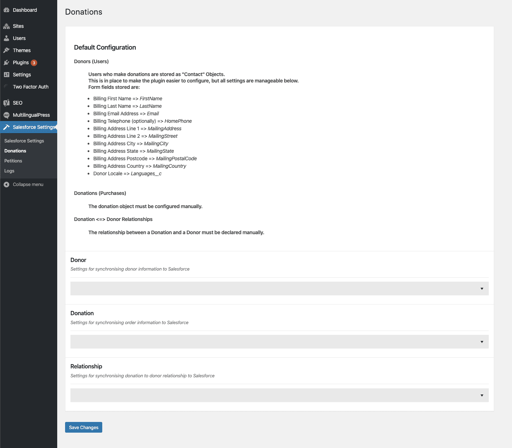

# Amnesty Donations Salesforce Adapter
This is a companion plugin for the primary [Humanity Donations](https://github.com/amnestywebsite/humanity-donations) plugin, which adds support for submitting donation data directly to Salesforce via their HTTP REST API, instead of storing it within the WP database.  

## Minimum Requirements
This plugin requires:  
- WordPress 5.8+  
- PHP 8.2+ with the Intl extension  
- [Humanity Theme](https://github.com/amnestywebsite/humanity-theme) v1.0.0+  
- [CMB2](https://github.com/CMB2/CMB2)
- [CMB2 Message Field](https://github.com/amnestywebsite/cmb2-message-field)
- [CMB2 Password Field](https://github.com/amnestywebsite/cmb2-password-field)
- [Humanity Donations](https://github.com/amnestywebsite/humanity-donations) v1.0.0+
- [Salesforce Connector](https://github.com/amnestywebsite/humanity-salesforce-connector) v1.0.0+  

## Installation
The quickest way to get started using the plugin is to download the zip of the [latest release](https://github.com/amnestywebsite/humanity-donations-salesforce-adapter/releases/latest), and install it via upload directly within WP Admin -> Plugins.  

## Configuration
Once activated, this plugin adds a settings page below the primary Salesforce Settings page in Network Admin. If you haven’t configured the Salesforce Connector plugin, do that first.  

The only configuration set up by default by the plugin is for Donor information; you need to tell the plugin how to handle how Donation transactions are stored in Salesforce, and the relationship between a Donor and a Donation. Optionally, you can modify the Donor.  

For each type of data, you need to specify the Salesforce resource type (usually an Object), and how each field available may map to a field on the resource. The settings page explains how the default Donor data is mapped into a Salesforce Contact Object.  

Once you have completed configuring the data mapping between WordPress and Salesforce, you’ll start to see transaction data being populated into Salesforce.  

Debug logging information can be viewed in the Logs page under Salesforce Settings.  

## Governance
See [GOVERNANCE.md](GOVERNANCE.md) for project governance information.  

## Changelog  
See [CHANGELOG.md](CHANGELOG.md) or [Releases page](https://github.com/amnestywebsite/humanity-donations-salesforce-adapter/releases) for full changelogs.

## Contributing
For information on how to contribute to the project, or to get set up locally for development, please see the documentation in [CONTRIBUTING.md](CONTRIBUTING.md).  

### Special Thanks
We'd like to say a special thank you to these lovely folks:

| &nbsp;&nbsp;&nbsp;&nbsp;&nbsp;&nbsp;&nbsp;&nbsp;&nbsp;&nbsp;&nbsp;&nbsp;&nbsp;&nbsp;[Cure53](https://cure53.de)&nbsp;&nbsp;&nbsp;&nbsp;&nbsp;&nbsp;&nbsp;&nbsp;&nbsp;&nbsp;&nbsp;&nbsp;&nbsp;&nbsp; | &nbsp;&nbsp;&nbsp;&nbsp;&nbsp;&nbsp;&nbsp;&nbsp;&nbsp;&nbsp;&nbsp;&nbsp;&nbsp;&nbsp;&nbsp;&nbsp;&nbsp;&nbsp;&nbsp;&nbsp;&nbsp;&nbsp;[WP Engine](https://wpengine.com)&nbsp;&nbsp;&nbsp;&nbsp;&nbsp;&nbsp;&nbsp;&nbsp;&nbsp;&nbsp;&nbsp;&nbsp;&nbsp;&nbsp;&nbsp;&nbsp;&nbsp;&nbsp;&nbsp;&nbsp;&nbsp;&nbsp; |
| --- | --- |
|  |  |

### Want to know more about the work in other Amnesty GitHub accounts?

You can find repositories from other teams such as [Amnesty Web Ops](https://github.com/amnestywebsite), [Amnesty Crisis](https://github.com/amnesty-crisis-evidence-lab), [Amnesty Tech](https://github.com/AmnestyTech), and [Amnesty Research](https://github.com/amnestyresearch/) in their GitHub accounts

